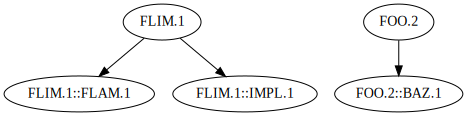

# Usage

This document contains integration tests which also serve as succinct,
reference-friendly, documentation of the tool's usage.

<!-- markdown-toc start - Don't edit this section. Run M-x markdown-toc-refresh-toc -->
**Table of Contents**

- [Usage](#usage)
    - [Environment](#environment)
        - [`kontxt --version`](#kontxt---version)
        - [`kontxt init`](#kontxt-init)
        - [Logging](#logging)
    - [Context management](#context-management)
        - [`kontxt new NAME`: Create a new context](#kontxt-new-name-create-a-new-context)
        - [`kontxt list`: List the available contexts](#kontxt-list-list-the-available-contexts)
        - [`kontxt switch NAME`: Switch between contexts](#kontxt-switch-name-switch-between-contexts)
    - [Repository management](#repository-management)
        - [`kontxt repo add REPO`: Add repositories to the current context](#kontxt-repo-add-repo-add-repositories-to-the-current-context)
        - [`kontxt repo list`: List the repositories in the current context](#kontxt-repo-list-list-the-repositories-in-the-current-context)
    - [Viewing logical units](#viewing-logical-units)
        - [`kontxt unit list`: A synoptic listing of the current context's units](#kontxt-unit-list-a-synoptic-listing-of-the-current-contexts-units)
            - [`kontxt unit list --format json`: A complete report of units in the current context](#kontxt-unit-list---format-json-a-complete-report-of-units-in-the-current-context)
            - [`kontxt unit list --format csv`: A complete report of units in the current context](#kontxt-unit-list---format-csv-a-complete-report-of-units-in-the-current-context)
        - [`kontxt unit show TAG`: Present all information about the unit](#kontxt-unit-show-tag-present-all-information-about-the-unit)
            - [`kontxt unit show TAG --format json`: The same in JSON](#kontxt-unit-show-tag---format-json-the-same-in-json)
            - [`kontxt unit show TAG --format csv`: The same in CSV](#kontxt-unit-show-tag---format-csv-the-same-in-csv)
    - [Synchronization](#synchronization)
        - [`kontxt sync`: Update the information in the current context](#kontxt-sync-update-the-information-in-the-current-context)
    - [Operating on files](#operating-on-files)
        - [Parsing](#parsing)
            - [`kontxt parse FILE --format json` (the default, if no argument is given)](#kontxt-parse-file---format-json-the-default-if-no-argument-is-given)
                - [`kontxt file parse FILE --format csv`](#kontxt-file-parse-file---format-csv)
    - [Processing](#processing)
        - [`kontxt file linkify FILE`](#kontxt-file-linkify-file)
    - [Generating views and reports](#generating-views-and-reports)
        - [Graphs](#graphs)
            - [`kontxt generate graph --format dot`](#kontxt-generate-graph---format-dot)
            - [`kontxt generate graph --format svg` (default)](#kontxt-generate-graph---format-svg-default)
        - [Static site](#static-site)
            - [`kontxt generate site`: Generate a static site summarizing the context](#kontxt-generate-site-generate-a-static-site-summarizing-the-context)

<!-- markdown-toc end -->

## Environment

These variables are used in the environment of the following tests. You can
ignore these when consulting this document for usage.

<!-- TODO replace by adding the executable to the path -->
```sh
$ echo RUST_LOG=$RUST_LOG
RUST_LOG=error
$ echo TRACER_HOME=$TRACER_HOME
TRACER_HOME=../target/test-sandbox
```

### `kontxt --version`

```sh
$ kontxt --version
kontxt 0.1.0
```

### `kontxt init`

```sh
$ kontxt init
Initialized into ../target/test-sandbox/.tracer
$ ls $TRACER_HOME/.tracer
tracer.db
```

### Logging

Set the logging level by setting the environment variable `RUST_LOG`. Valid
levels are

- `error`
- `warn` (default)
- `info`
- `debug`
- `trace`

E.g.,

```sh
$ RUST_LOG=info kontxt --version 2>&1 | sed "s/^.*Z /[/"
[INFO  kontxt] log level set to info
kontxt 0.1.0
```

## Context management

### `kontxt new NAME`: Create a new context

```sh
$ kontxt new foo
```

### `kontxt list`: List the available contexts

The current context is stared.

```sh
$ kontxt list
* foo
```

Creating a new context also activates it. 

```sh
$ kontxt new bar
$ kontxt list
* bar
  foo
```

### `kontxt switch NAME`: Switch between contexts

```sh
$ kontxt switch foo; kontxt list
  bar
* foo
```

## Repository management

Assume we want to work with the following repositories:

**NOTE**: Here and in following sections, we use the filter `| sed "s:$(pwd)/::"` 
to trim the absolute path prefix from output. But, the tool always associates
repositories with  their absolute (local) path.

```sh
$ mkdir repos
$ git init repos/repo-a | sed "s:$(pwd)/::"
Initialized empty Git repository in repos/repo-a/.git/
$ git init repos/repo-b | sed "s:$(pwd)/::" # We trim the absolute path prefix, for testing purposes
Initialized empty Git repository in repos/repo-b/.git/
```

We'll also add a fake upstream to one of the repos:

```sh
$ cd repos/repo-a ; git remote add upstream git@github.com:informalsystems/themis-tracer.git
$ cd repos/repo-a ; git remote -v
upstream	git@github.com:informalsystems/themis-tracer.git (fetch)
upstream	git@github.com:informalsystems/themis-tracer.git (push)
```

Assume also that `repo-a` contains some specs with logical units:

```sh
$ cat > repos/repo-a/spec-1.md<<EOF \
> |FOO.1| \
> : First unit. \
> \
> |FOO.1::BAR.1| \
> : A unit with a long description: "Proofs, from the formal standpoint, are likewise nothing but finite series of formulae (with certain specifiable characteristics)." \
> EOF
$ mkdir repos/repo-a/dir
$ cat > repos/repo-a/dir/spec-2.md <<EOF \
> |FLIM.1| \
> : A unit in a nested directory.\
> \
> |FLIM.1::FLAM.1| \
> : Second unit in the same directory. \
>   This one has a newline.  And refers to [FLIM.1]\
> EOF
$ cat > repos/repo-a/dir/main.rs <<EOF \
> //! An program implemnting FLIM \
> \
> /// |FLIM.1::IMPL.1| \
> fn main() { \
>   println!("implements FLIM.1") \
> } \
>  \
> EOF
```

### `kontxt repo add REPO`: Add repositories to the current context

Add a repo to your current working context as follows:

```sh
$ kontxt repo add repos/repo-a
$ kontxt repo add repos/repo-b
```

When a repository is added to a context, all of the logical units that the tool
can find in the repository are loaded into the database. See [Viewing logical
units](#viewing-logical-units).

### `kontxt repo list`: List the repositories in the current context

```sh
$ kontxt list | grep "\*"
* foo
$ kontxt repo list | sed "s:$(pwd)/::"
  repos/repo-a
  repos/repo-b
```

Each context has it's own associated repos. We haven't added any repos to  the
context `bar` yet, so if we switch contexts and then list its repos, we'll see
that reflected:

```sh
$ kontxt switch bar
$ kontxt repo list
```

## Viewing logical units

### `kontxt unit list`: A synoptic listing of the current context's units

```sh
$ kontxt switch foo
$ kontxt list
  bar
* foo
$ kontxt unit list | sed "s:$(pwd)/::" # We trim the absolute path prefix, for testing purposes
FLIM.1          repos/repo-a  A unit in a nested directory.
FLIM.1::FLAM.1  repos/repo-a  Second unit in the same directory. This one has a newline. And refers to [FLIM.1]
FLIM.1::IMPL.1  repos/repo-a
FOO.1           repos/repo-a  First unit.
FOO.1::BAR.1    repos/repo-a  A unit with a long description: “Proofs, from the formal standpoint, are likewise nothing but finite series of formulae (with certain specifiable characteristics).”
```

#### `kontxt unit list --format json`: A complete report of units in the current context

```sh
$ kontxt unit list --format json | sed "s:$(pwd)/::"
{"id":"FLIM.1","kind":"Requirement","repo":{"location":{"inner":{"Local":{"path":"repos/repo-a","upstream":"git@github.com:informalsystems/themis-tracer.git","branch":null}}}},"file":"dir/spec-2.md","line":null,"content":"A unit in a nested directory.","references":[]}
{"id":"FLIM.1::FLAM.1","kind":"Requirement","repo":{"location":{"inner":{"Local":{"path":"repos/repo-a","upstream":"git@github.com:informalsystems/themis-tracer.git","branch":null}}}},"file":"dir/spec-2.md","line":null,"content":"Second unit in the same directory. This one has a newline. And refers to [FLIM.1]","references":[]}
{"id":"FLIM.1::IMPL.1","kind":"Implementation","repo":{"location":{"inner":{"Local":{"path":"repos/repo-a","upstream":"git@github.com:informalsystems/themis-tracer.git","branch":null}}}},"file":"dir/main.rs","line":2,"content":"","references":[]}
{"id":"FOO.1","kind":"Requirement","repo":{"location":{"inner":{"Local":{"path":"repos/repo-a","upstream":"git@github.com:informalsystems/themis-tracer.git","branch":null}}}},"file":"spec-1.md","line":null,"content":"First unit.","references":[]}
{"id":"FOO.1::BAR.1","kind":"Requirement","repo":{"location":{"inner":{"Local":{"path":"repos/repo-a","upstream":"git@github.com:informalsystems/themis-tracer.git","branch":null}}}},"file":"spec-1.md","line":null,"content":"A unit with a long description: “Proofs, from the formal standpoint, are likewise nothing but finite series of formulae (with certain specifiable characteristics).”","references":[]}
```

#### `kontxt unit list --format csv`: A complete report of units in the current context

```sh
$ kontxt unit list --format csv | sed "s:$(pwd)/::"
FLIM.1,Requirement,repos/repo-a,git@github.com:informalsystems/themis-tracer.git,,dir/spec-2.md,,A unit in a nested directory.
FLIM.1::FLAM.1,Requirement,repos/repo-a,git@github.com:informalsystems/themis-tracer.git,,dir/spec-2.md,,Second unit in the same directory. This one has a newline. And refers to [FLIM.1]
FLIM.1::IMPL.1,Implementation,repos/repo-a,git@github.com:informalsystems/themis-tracer.git,,dir/main.rs,2,
FOO.1,Requirement,repos/repo-a,git@github.com:informalsystems/themis-tracer.git,,spec-1.md,,First unit.
FOO.1::BAR.1,Requirement,repos/repo-a,git@github.com:informalsystems/themis-tracer.git,,spec-1.md,,"A unit with a long description: “Proofs, from the formal standpoint, are likewise nothing but finite series of formulae (with certain specifiable characteristics).”"
```

### `kontxt unit show TAG`: Present all information about the unit

Show all recorded information associated with the particular unit identified by
the given `TAG`:

```sh
$ kontxt unit show FOO.1::BAR.1 | sed "s:$(pwd)/::"
tag:   FOO.1::BAR.1
kind:  Requirement
repo:  repos/repo-a
file:  spec-1.md
line:
refs:

A unit with a long description: “Proofs, from the formal standpoint, are likewise nothing but finite series of formulae (with certain specifiable characteristics).”
```

#### `kontxt unit show TAG --format json`: The same in JSON

Using the `--format json` option outputs the complete data of a logical unit
serialized into JSON:

```sh
$ kontxt unit show FOO.1::BAR.1 --format json | sed "s:$(pwd)/::" | jq
{
  "id": "FOO.1::BAR.1",
  "kind": "Requirement",
  "repo": {
    "location": {
      "inner": {
        "Local": {
          "path": "repos/repo-a",
          "upstream": "git@github.com:informalsystems/themis-tracer.git",
          "branch": null
        }
      }
    }
  },
  "file": "spec-1.md",
  "line": null,
  "content": "A unit with a long description: “Proofs, from the formal standpoint, are likewise nothing but finite series of formulae (with certain specifiable characteristics).”",
  "references": []
}
```

#### `kontxt unit show TAG --format csv`: The same in CSV

Using the `--format csv` option outputs the complete data of a logical unit,
serialized into CSV:

```sh
$ kontxt unit show FOO.1::BAR.1 --format csv | sed "s:$(pwd)/::"
FOO.1::BAR.1,Requirement,repos/repo-a,git@github.com:informalsystems/themis-tracer.git,,spec-1.md,,"A unit with a long description: “Proofs, from the formal standpoint, are likewise nothing but finite series of formulae (with certain specifiable characteristics).”"
```

## Synchronization

### `kontxt sync`: Update the information in the current context

When the artifacts in a repository have been changed, the database of logical
units is updated using the `sync` subcommand.

Let's make some changes to `spec-1.md` in `repo-a`:

```sh
$ cat > repos/repo-a/spec-1.md<<EOF \
> |FOO.2| \
> : We've updated the first unit. \
> \
> |FOO.2::BAZ.1| \
> : And we replaced FOO.1::BAR.1 with this unit. \
> EOF
```

After syncing, the units in the context will be updated accordingly:

```sh
$ kontxt sync
$ kontxt unit list | sed "s:$(pwd)/::"
FLIM.1          repos/repo-a  A unit in a nested directory.
FLIM.1::FLAM.1  repos/repo-a  Second unit in the same directory. This one has a newline. And refers to [FLIM.1]
FLIM.1::IMPL.1  repos/repo-a
FOO.2           repos/repo-a  We’ve updated the first unit.
FOO.2::BAZ.1    repos/repo-a  And we replaced FOO.1::BAR.1 with this unit.
```

## Operating on files

You can use the tool to parse and transform files containing logical units. 

The former enables users to do computations with the specs via your own scripts
or programs.

The following spec describes our current support for parsing logical units:

<!-- $MDX file=parsing-spec.md -->
```markdown
# Parsing logical units

|PARSE-SPECS.1|
: We can parse a file of logical units into different formats, preserving all
  critical content of the logical unit content.

## Serialization Format

Supported formats include:

|PARSE-SPECS.1::FORMAT.1|
: Must support parsing specs into machine readable formats.

|PARSE-SPECS.1::FORMAT.1::JSON.1|
: Must support parsing a file of specs into JSON.

|PARSE-SPECS.1::FORMAT.1::CSV.1|
: Must support parse a file of specs into CSV.

## Content

|PARSE-SPECS.1::CONTENT.1|
: Parsing must support all expected forms of content.

|PARSE-SPECS.1::CONTENT.1::MULTI-PARA.1|
: The content of logical units must be preserved.
: Even when it spans multiple paragraphs.
: - Or
 - includes
 - lists

|PARSE-SPECS.1::CONTENT.1::INLINE.1|
: The folowing inline styling must be preserved:
: - **Strong** (__both__ ways)
 - *Emphasizes* (_both_ ways)
 - ~~Strikethrough~~
 - `code`
 - [links](/url)
 - 
 - [smallcaps]{.smallcaps}
```

We'll use this spec as an example to illustrate the supported operations on files.

### Parsing

<!-- TODO Annotate with verification tags, tying to the implementations -->

#### `kontxt parse FILE --format json` (the default, if no argument is given)

The default formatting for parsed files is a stream of JSON objects:

```sh
$ kontxt file parse parsing-spec.md | jq
{
  "id": "PARSE-SPECS.1",
  "kind": "Requirement",
  "repo": null,
  "file": "parsing-spec.md",
  "line": null,
  "content": "We can parse a file of logical units into different formats, preserving all critical content of the logical unit content.",
  "references": []
}
{
  "id": "PARSE-SPECS.1::CONTENT.1",
  "kind": "Requirement",
  "repo": null,
  "file": "parsing-spec.md",
  "line": null,
  "content": "Parsing must support all expected forms of content.",
  "references": []
}
{
  "id": "PARSE-SPECS.1::CONTENT.1::INLINE.1",
  "kind": "Requirement",
  "repo": null,
  "file": "parsing-spec.md",
  "line": null,
  "content": "The folowing inline styling must be preserved:\n\n* **Strong** (**both** ways)\n* *Emphasizes* (*both* ways)\n* ~~Strikethrough~~\n* `code`\n* [links](/url)\n* \n* smallcaps",
  "references": []
}
{
  "id": "PARSE-SPECS.1::CONTENT.1::MULTI-PARA.1",
  "kind": "Requirement",
  "repo": null,
  "file": "parsing-spec.md",
  "line": null,
  "content": "The content of logical units must be preserved.\n\nEven when it spans multiple paragraphs.\n\n* Or\n* includes\n* lists",
  "references": []
}
{
  "id": "PARSE-SPECS.1::FORMAT.1",
  "kind": "Requirement",
  "repo": null,
  "file": "parsing-spec.md",
  "line": null,
  "content": "Must support parsing specs into machine readable formats.",
  "references": []
}
{
  "id": "PARSE-SPECS.1::FORMAT.1::CSV.1",
  "kind": "Requirement",
  "repo": null,
  "file": "parsing-spec.md",
  "line": null,
  "content": "Must support parse a file of specs into CSV.",
  "references": []
}
{
  "id": "PARSE-SPECS.1::FORMAT.1::JSON.1",
  "kind": "Requirement",
  "repo": null,
  "file": "parsing-spec.md",
  "line": null,
  "content": "Must support parsing a file of specs into JSON.",
  "references": []
}
```

##### `kontxt file parse FILE --format csv`

```sh
$ kontxt file parse parsing-spec.md --format csv
PARSE-SPECS.1,Requirement,,parsing-spec.md,,"We can parse a file of logical units into different formats, preserving all critical content of the logical unit content."
PARSE-SPECS.1::CONTENT.1,Requirement,,parsing-spec.md,,Parsing must support all expected forms of content.
PARSE-SPECS.1::CONTENT.1::INLINE.1,Requirement,,parsing-spec.md,,"The folowing inline styling must be preserved:

* **Strong** (**both** ways)
* *Emphasizes* (*both* ways)
* ~~Strikethrough~~
* `code`
* [links](/url)
* 
* smallcaps"
PARSE-SPECS.1::CONTENT.1::MULTI-PARA.1,Requirement,,parsing-spec.md,,"The content of logical units must be preserved.

Even when it spans multiple paragraphs.

* Or
* includes
* lists"
PARSE-SPECS.1::FORMAT.1,Requirement,,parsing-spec.md,,Must support parsing specs into machine readable formats.
PARSE-SPECS.1::FORMAT.1::CSV.1,Requirement,,parsing-spec.md,,Must support parse a file of specs into CSV.
PARSE-SPECS.1::FORMAT.1::JSON.1,Requirement,,parsing-spec.md,,Must support parsing a file of specs into JSON.
```

## Processing

### `kontxt file linkify FILE`

The tool can add unit reference links and unit definition anchors to
specifications written in markdown.

Consider the specs used in the section on [managing
repositories](#managing-repositories), in `repo-a`, which is registered  in
context `foo`:

```sh
$ kontxt list
  bar
* foo
$ kontxt repo list | sed "s:$(pwd)/::"
  repos/repo-a
  repos/repo-b
$ ls repos/repo-a/*.md repos/repo-a/dir/*.md
repos/repo-a/dir/spec-2.md
repos/repo-a/spec-1.md
```

We can linkify them with

```sh
$ kontxt file linkify repos/repo-a/*.md repos/repo-a/dir/*.md
```

Which will change the files in place, yielding the following:

```sh
$ for f in repos/repo-a/*.md repos/repo-a/dir/*.md; do printf "\nin $f...\n\n"; cat $f | sed "s:$(pwd)/::"; done

in repos/repo-a/spec-1.md...

<span id="FOO.2">|FOO.2|</span>
:   We've updated the first unit.

<span id="FOO.2::BAZ.1">|FOO.2::BAZ.1|</span>
:   And we replaced FOO.1::BAR.1 with this unit.

in repos/repo-a/dir/spec-2.md...

<span id="FLIM.1">|FLIM.1|</span>
:   A unit in a nested directory.

<span id="FLIM.1::FLAM.1">|FLIM.1::FLAM.1|</span>
:   Second unit in the same directory. This one has a newline. And
    refers to [FLIM.1]

  [FLIM.1]: https://github.com/informalsystems/themis-tracer/blob/master/dir/spec-2.md#FLIM.1
```

## Generating views and reports

Generate views and reports to help understand and navigate contexts.

### Graphs

#### `kontxt generate graph --format dot`

We can generate a graphviz dot graph of the current context with

```sh
$ kontxt generate graph --format dot
digraph {
    0 [ label="FLIM.1" tooltip="A unit in a nested directory." href="TODO#FLIM.1" ]
    1 [ label="FLIM.1::FLAM.1" tooltip="Second unit in the same directory. This one has a newline. And refers to [FLIM.1]" href="TODO#FLIM.1::FLAM.1" ]
    2 [ label="FLIM.1::IMPL.1" tooltip="" href="TODO#FLIM.1::IMPL.1" ]
    3 [ label="FOO.2" tooltip="We’ve updated the first unit." href="TODO#FOO.2" ]
    4 [ label="FOO.2::BAZ.1" tooltip="And we replaced FOO.1::BAR.1 with this unit." href="TODO#FOO.2::BAZ.1" ]
    0 -> 1 [ ]
    0 -> 2 [ ]
    3 -> 4 [ ]
}

```

#### `kontxt generate graph --format svg` (default)

And we can generate an SVG of the context with

```sh
$ kontxt generate graph --format svg > context.svg
```



### Static site


#### `kontxt generate site`: Generate a static site summarizing the context

```sh
$ kontxt generate site
<html >
  <head >
    <title >
        Context
    </title>
  </head>
  <body >
    <dl >
      <dt id="FLIM.1">
        <strong >
            FLIM.1
        </strong>
      </dt>
      <dd >
        <p class="content">
            A unit in a nested directory.
        </p>
        <details class="implementations">
          <summary >
              Implemented by...
          </summary>
          <dl >
            <dt id="FLIM.1::IMPL.1">
              <strong >
                  FLIM.1::IMPL.1
              </strong>
            </dt>
            <dd >
              <p class="content">

              </p>
            </dd>
            <dt id="FLIM.1::FLAM.1">
              <strong >
                  FLIM.1::FLAM.1
              </strong>
            </dt>
            <dd >
              <p class="content">
                  Second unit in the same directory. This one has a newline. And refers to [FLIM.1]
              </p>
            </dd>
          </dl>
        </details>
      </dd>
      <dt id="FOO.2">
        <strong >
            FOO.2
        </strong>
      </dt>
      <dd >
        <p class="content">
            We’ve updated the first unit.
        </p>
        <details class="implementations">
          <summary >
              Implemented by...
          </summary>
          <dl >
            <dt id="FOO.2::BAZ.1">
              <strong >
                  FOO.2::BAZ.1
              </strong>
            </dt>
            <dd >
              <p class="content">
                  And we replaced FOO.1::BAR.1 with this unit.
              </p>
            </dd>
          </dl>
        </details>
      </dd>
    </dl>
  </body>
</html>
```
